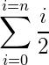
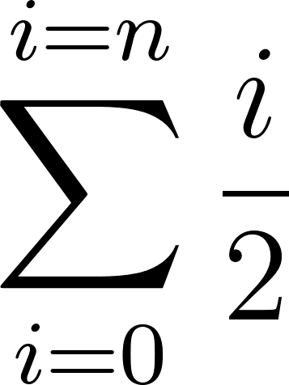

Tex2png
=======

This class provides a way to create easily LaTeX formulas.

With it, you can convert raw formulas like:

`\sum_{i = 0}^{i = n} \frac{i}{2}`

To nice images like:



Requirement
-----------

To use this library you'll need :

* **latex** : to compile formulas (with math support)
* **dvipng** : to convert dvis to png
* **shell_exec** : you need to be able to call the php `shell_exec()` function

You'll also need a temporary folder and, of courses, enough permissions to write to the 
target directory

Usage
-----

Just include the `Tex2png.php` file or register this repository directory as the
`Gregwar\Tex2png\` namespace and do the following :

```php
<?php

// This will create a formula and save it to sum.png
Tex2png::create('\sum_{i = 0}^{i = n} \frac{i}{2}')
    ->saveTo('sum.png')
    ->generate();
```

You can have a look at the example in `example/` directory.

Using the cache
---------------

Tex2png library includes a caching system allowing you to generate images only one time.
To do so, just don't tell `Tex2png` what is the target file :

```php
<?php

Tex2png::create('\sum_{i = 0}^{i = n} \frac{i}{2}')
    ->generate();

// The filename will be choosen using an hash of the formula and
// the image density. (file name will look like cache/tex/3/0/2/e/6/8febefe7aaed9eeb8abf09070d10e02e93e.png)
```

If the file already exists, it will not generate anything, else, it will generate it. This results in a 
tiny but powerful caching system avoiding to regenerate a formula PNG twice.

Note that you can change the cache directory calling the `setCacheDirectory()` function

This is based on the [Gregwar/Cache](https://github.com/Gregwar/Cache/) library.

Changing the density
--------------------

The second constructor/create() parameter is the image density :

```php
<?php

Tex2png::create('\sum_{i = 0}^{i = n} \frac{i}{2}', 300)
    ->generate();
```

Default density is **155**, you can choose to generate really big images, this is an example
of the formula with a density of 1000 :



License
-------

This class is under MIT license, for more information, please refer to the `LICENSE` file
